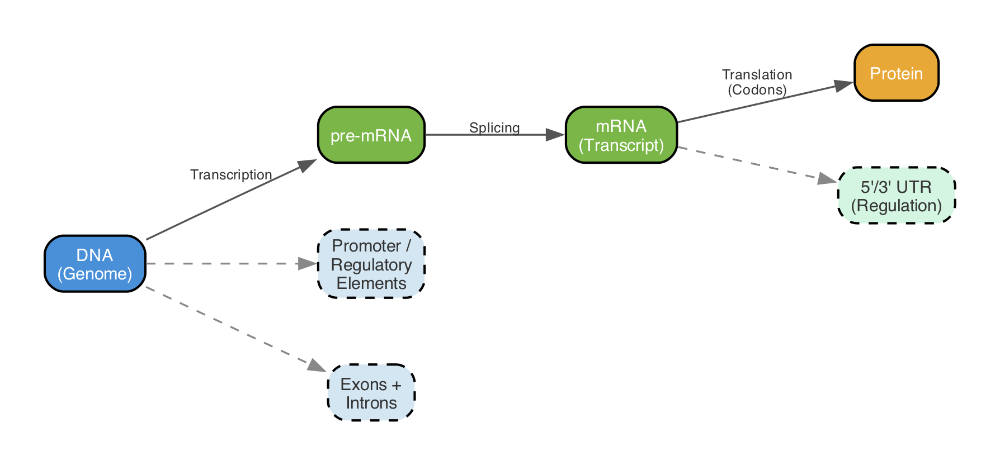
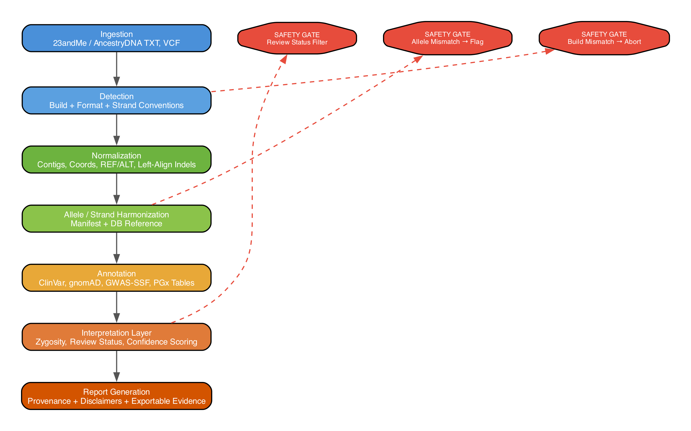

# Genomics Practical Primer for Software Engineers

## Executive Summary

A consistent, secure consumer genomics annotation fails in practice rarely because of "missing data," but almost always because of misaligned representations: wrong build, wrong strand convention, missing normalization, wrong allele counted, wrong assumptions for missing markers. This is not a "bio problem" but a data model and normalization problem. citeturn26view1turn26view0turn9view2turn9view3turn12search7turn27search1

For a GeneSight-like pipeline, the following are safety-critical:

- **Enforce build/coordinates/REF alleles:** Every input must be unambiguously bound to a reference (GRCh37/GRCh38 + contig naming); "chr" prefixes and MT/chrM are not cosmetic but part of the identity schema. citeturn39view1turn39view3turn12search2turn26view1
- **Strand and allele normalization before any interpretation:** Consumer raw data is often plus/forward relative to GRCh37, but interop with Illumina manifests (TOP/BOT, A/B) and external resources requires explicit translation. citeturn26view1turn26view0turn9view2turn9view3turn25search0
- **Count alleles instead of "matching" rsIDs:** Annotation is always coupled to a **specific allele** (pathogenic/risk/effect allele). Without "allele-aware" matching, results are structurally incorrect. citeturn9view3turn16view1turn33view1
- **Strictly bind clinical assertions to evidence levels:** ClinVar provides aggregated classifications and review status; both must feed into UI/score. citeturn28search0turn28search19turn19search4turn19search2
- **Do not treat pharmacogenetics as individual SNPs:** Star alleles/diplotype/phenotype tables (CPIC/PharmVar) are the model; consumer arrays are also CNV-blind (especially CYP2D6). citeturn20search8turn20search1turn20search16turn20search5turn10search7
- **Validate like software engineering:** Gold standards (GIAB/NIST), regression tests for normalization/allele counting, provenance logging. citeturn5search19turn5search15

## Biological Fundamentals for Annotation

DNA is a **directed string** over an alphabet {A,C,G,T}, physically organized as a double helix; the two strands are complementary (A-T, C-G). This is the basis for all "strand" error classes: the same position can be described as a base or as a complement base. citeturn9view1turn7search11turn7search0turn26view1

**Genes, Transcripts, Proteins (mental model):** A gene is a heritable unit of information; in eukaryotes, a gene typically consists of **exons** (remain in the final mRNA product) and **introns** (removed during splicing). Promoters control the start of transcription. mRNA is subsequently translated into protein; codons are 3-letter words, open reading frames define the readable frame. citeturn6search10turn6search0turn9view0turn6search11turn6search1turn7search1turn7search8turn6search3turn6search14

**UTRs (5'/3') are transcribed but not part of the canonical protein sequence:** They flank the coding sequence and influence regulation (stability/translation etc.). For annotation, this means: many disease-relevant variants lie outside the CDS but are still biologically functional. citeturn7search6turn6search5

**Variant classes as data types:**
SNVs/SNPs (single base), small indels, CNVs (copy number), structural variants (SVs: larger rearrangements). For a pipeline, it is important that **each class requires different normalization/matching rules**; rsID-only is primarily an SNP/small-indel shortcut. citeturn5search17turn10search7turn27search2

**Zygosity and genotype counting:** In diploid regions, a genotype is present as 0/1/2 copies of an allele; for X/Y, hemizygosity exists (one copy). Compound heterozygosity means two different pathogenic alleles at the same gene locus. These terms are directly UI-relevant (carrier vs. affected, dominant/recessive logic). citeturn7search3turn7search7turn37search2turn37search3

**Haplotypes, Phasing, Linkage Disequilibrium:** A haplotype is a block of co-inherited variants; phasing assigns variants to the two parental chromosome copies. LD is the statistical "coupling degree" between variants and enables, for example, strand alignment for palindromic SNPs via reference patterns. citeturn3search0turn24search0turn25search0

**Allele Frequency, Penetrance, Expressivity:**
Allele frequency is the population frequency of an allele and is a key signal for "too common for a highly penetrant Mendelian disease." Penetrance is the probability that a genotype becomes phenotypically visible at all; expressivity describes the variation in manifestation. citeturn4search1turn4search3turn7search6turn19search2turn17search5

**Inheritance patterns:** autosomal dominant/recessive, X-linked, mitochondrial (maternal). For mtDNA, heteroplasmy and tissue dependence additionally apply; consumer arrays are often unsuitable or only partially interpretable for these. citeturn37search21turn37search0turn37search3turn37search1



## Laboratory and Measurement Methods

### Genotyping Arrays

Consumer services predominantly use SNP arrays: for each marker there are probes, intensities are clustered into genotype classes (AA/AB/BB); the result is a list of tested positions, not "the genome." Illumina distinguishes several levels of allele/strand designation: **TOP/BOT strand** and **A/B alleles** are internal, context-based Illumina conventions that do not automatically correspond to the dbSNP FWD/REV orientation. citeturn9view2turn9view3turn25search13turn26view2

**Illumina manifest files are the key to correct translation:** For GSA, Illumina provides manifest files (CSV/BPM) separately for GRCh37 and GRCh38 as well as cluster files (EGT) that represent the clustering. The manifest contains, among other things, IlmnStrand/RefStrand and the SNP notation in Illumina syntax. citeturn26view2turn9view3

### Strand/Build in Consumer Raw Data

For the two relevant consumer exports, the following is documented:

- 23andMe: Genotypes are reported on the **plus strand** of the respective reference (GRCh37 by default, optionally GRCh38); mismatches to third-party sources arise, among other reasons, from different strand/build references. citeturn26view1turn22search6
- AncestryDNA: Genotypes are reported on the **forward strand relative to GRCh37**. citeturn26view0

This does not automatically solve the interop problem, because databases/tools use additional conventions (Illumina manifest, dbSNP/PTLP, GWAS summary harmonization). citeturn9view3turn14search5turn33view1

### Sequencing and Variant Calling

Sequencing determines base sequences directly (WGS/WES/targeted). WGS covers the entire genome; WES focuses on exons and is typically cheaper than WGS, but not proportionally to the exome size. citeturn6search6turn19search7turn10search4

**Short reads: typical pipeline**: Reads are mapped against a reference (e.g., BWA), stored as SAM/BAM (SAM specification), then variants are consolidated caller-side into VCF/BCF (e.g., GATK Best Practices for SNPs/indels). citeturn23search0turn23search2turn23search1turn23search6

**VCF quality fields (engineering-relevant):** DP (Depth), GQ (Genotype Quality), PL (Phred-scaled Genotype Likelihoods) are standardized in the VCF ecosystem and are suitable as machine-readable confidence signals. citeturn26view3turn24search21turn23search1

### CNVs/SVs and Long Reads

CNVs can be model-based estimated from SNP arrays via intensity measures (BAF/LRR) (e.g., PennCNV), but are methodologically more difficult and tool-dependent. citeturn10search7turn10search3
Long-read sequencing reads significantly longer DNA fragments and particularly improves SV and haplotype resolution. citeturn19search14turn19search19

### Targeted Assays

Sanger sequencing is a classic, highly accurate targeted method (chain termination), suitable for confirming individual variants; PCR is often the preliminary step for targeted amplification. citeturn23search3turn23search7turn23search11

## Data Formats and Standards

### Reference Genomes and Coordinates

GRCh38 is the current official designation of the human reference; UCSC calls GRCh38 "hg38," but that is not the official name. Patch releases (e.g., GRCh38.pX) modify imports/alt loci without breaking coordinates; in toolchains, patches are often not supported for operational reasons. citeturn39view1turn39view3turn13search3

GRCh38 is also the first major **coordinate-changing** assembly since 2009 (vs. GRCh37) and contains many fixes from single-base to Mb scale. citeturn39view2

### rsID, VCF, HGVS, SPDI, VRS

- **rsID** is a database identifier (dbSNP/ClinVar/...); it is practical but not fully stable (merges/updates) and never replaces the concrete allele and position representation. dbSNP reports alleles in the new RefSNP report logic consistently "forward" relative to the reported sequence (typically: GRCh38/PTLP). citeturn14search5turn11search1turn27search3
- **VCF** is the dominant exchange representation for variants; indel normalization (left-alignment/trimming) is critical for comparability. citeturn24search21turn12search7
- **HGVS** is the human-readable clinical nomenclature (DNA/RNA/protein). citeturn11search3turn11search11turn11search23
- **SPDI** is an NCBI data model (Sequence, Position, Deletion, Insertion) and is used, among other things, for normalization/interconversion; SPDI position is 0-based (practically relevant for off-by-one errors). citeturn14search1turn16view1turn14search5
- **GA4GH VRS** is a machine-precise specification for variation representation including normalization (fully-justified). citeturn27search9turn27search1turn11search18turn27search0

### Liftover and Normalization

Liftover between assemblies is based on whole-genome alignments/chain files and is not "just renaming contigs." For GRCh37-GRCh38, **UCSC liftOver** and the **Ensembl Assembly Map REST API** are robust options; the former NCBI Remap service has been discontinued. citeturn13search0turn13search9turn12search6turn12search0turn39view3

**VCF normalization:** `bcftools norm` can left-align indels, normalize, split multiallelic sites, and check REF against the reference. This is mandatory before you compare as "equal." citeturn12search7turn12search3

## Population Genetics for Annotation and PRS

### Hardy-Weinberg and QC

Hardy-Weinberg Equilibrium (HWE) is a model that derives expected genotype frequencies from allele frequencies; deviations are frequently used in GWAS/QC as a signal for genotyping errors. citeturn17search7turn17search11turn35view0turn25search9

### Population Structure and Ancestry

Population structure creates systematic allele frequency differences between groups; this is a major source of spurious correlations. PCA-based correction (EIGENSTRAT/principal components) is standard in GWAS; ADMIXTURE provides model-based "ancestry proportions." citeturn18search1turn18search0

For consumer annotation, this is practically relevant because:

- Allele frequencies (e.g., from gnomAD) vary population-specifically. citeturn4search1turn17search5turn17search9
- GWAS/PRS are often significantly better in European cohorts than in other ancestries; current PRS can amplify inequalities if uncritically "ported." citeturn18search2

### Reference Panels

1000 Genomes Phase 3 comprises 2,504 individuals from 26 populations (originally GRCh37, reanalyzed on GRCh38) and serves, among other things, as a reference panel for imputation/phasing. citeturn17search8turn17search0turn24search3
gnomAD aggregates large exome/genome cohorts and is the central frequency reference in research and clinical interpretation. citeturn17search9turn17search5

### GWAS Effect Sizes, Risk Alleles, PRS

GWAS effect sizes are typically reported **per effect allele count** (per-allele); for binary traits as "increased odds per risk allele count." citeturn35view0turn34search5

For PRS, the standard idea is: **dosage of the effect allele (0/1/2) x weight**, summed over variants; the PGS Catalog download schema describes this semantics explicitly. citeturn36search9turn36search0

For production implementations, it is relevant that the GWAS Catalog now enforces GWAS-SSF and provides harmonized files: mandatory fields include chromosome, position, effect allele, other allele, beta/OR/HR, SE, effect allele frequency, and p-value; harmonized versions are on GRCh38, alleles "forward strand" oriented, non-harmonizable variants are removed. citeturn33view1

## Clinical Interpretation and Pharmacogenetics

### ClinVar and ACMG Basic Logic

ClinVar is a public archive of variant interpretations (disease and drug response) and calculates aggregated classifications separately for **germline**, **somatic clinical impact**, and **oncogenicity**. citeturn28search17turn28search0turn28search9turn28search1

The clinical terminology "pathogenic/likely pathogenic/VUS/likely benign/benign" is standardized by ACMG/AMP. citeturn19search4turn19search1

**Review status** (stars) is an independent evidence signal; ClinVar calculates review status per classification type on VCV/RCV. Without this signal, a "Pathogenic" UI is dangerously overconfident. citeturn28search19turn28search3

**Population frequency as a benign signal:** BA1 uses a high allele frequency (classically 5%) as standalone benign evidence; ClinGen SVI has refined the BA1 definition (including population dataset size). citeturn19search2turn19search9

### Pharmacogenetics: Named Alleles, Diplotypes, Phenotypes

Pharmacogenetics model: Define **named alleles (star alleles)** as variant sets, derive **diplotype** (two haplotypes) from them, translate via function/phenotype tables (e.g., Activity Score for CYP2D6) into clinical categories. CPIC/ClinPGx provide diplotype-to-phenotype tables. citeturn20search1turn20search5turn20search13

PharmCAT implements this logic as a pipeline; the Named Allele Matcher derives diplotypes from variant calls and can also run independently. CPIC also provides architecture examples/modules for PharmCAT. citeturn20search8turn20search0turn20search16turn20search4

**Array limitations:** Complex pharmacogenes (especially CYP2D6) are heavily shaped by SV/CNV; many star allele callers are designed for NGS (Stargazer/Aldy) and model copy number explicitly. This is a structural hint: consumer arrays often provide only incomplete evidence for such genes. citeturn20search2turn20search19turn20search11turn10search7

## Engineering Blueprint for GeneSight

### Data Flow and Safety Gates



The pipeline requires hard invariants:

- **Model every variant as (assembly, contig, pos, REF, ALT)**, rsID only as a secondary index. citeturn24search21turn14search5turn16view1
- **REF allele verification against the reference genome** (or against a curated sequence source) before interpretation. Tooling: `bcftools norm -f ref.fa` checks REF matches. citeturn12search7turn12search3
- **Allele and strand translation explicitly** (Illumina TOP/BOT/A/B - plus/forward - dbSNP/PTLP). citeturn9view2turn9view3turn14search5

### Strand/Allele Normalization: Core Algorithm

**Problem class:** The same biochemical variant can appear as C>T on the plus strand or as G>A on the minus strand. Consumer raw data is often plus/forward relative to GRCh37, but external sources can differ depending on pipeline, manifest, or historical convention. citeturn26view1turn26view0turn9view3turn14search5

**Ambiguity:** Palindromic SNPs (A/T or C/G) look identical after complementation; pure strand complementation is not sufficient to reliably infer orientation from data alone. Tools like Genotype Harmonizer solve this via LD patterns, among other methods; snpflip marks reverse/ambiguous SNPs. citeturn25search0turn25search1

Pseudocode (allele-aware, strand-aware, palindromic-aware):

```text
# Inputs:
# - user_genotype: two alleles as characters (e.g., ["C","T"] or ["A","A"])
# - record_ref, record_alt: alleles as stored in a reference-oriented database (VCF-style)
# - record_strand: "+" or "-" if known; else None
# - user_strand: "+" if export guarantees plus/forward (often true), else None
# - ref_genome_lookup(contig, pos): returns reference base at pos for chosen assembly

COMPLEMENT = {"A":"T","T":"A","C":"G","G":"C"}

function is_palindromic(a1, a2):
  pair = set([a1,a2])
  return pair == set(["A","T"]) or pair == set(["C","G"])

function normalize_alleles_to_plus(alleles, strand):
  if strand == "+":
    return alleles
  if strand == "-":
    return [COMPLEMENT[x] for x in alleles]
  raise error("unknown strand")

function count_alt_copies(genotype_alleles, alt_allele):
  # genotype_alleles already normalized to same strand as alt_allele
  return (genotype_alleles[0] == alt_allele) + (genotype_alleles[1] == alt_allele)

# Main:
assert ref_genome_lookup(contig,pos) == record_ref   # or fail-safe
db_ref_alt = [record_ref, record_alt]

# If both sides are guaranteed plus, skip strand flip.
if user_strand == "+" and record_strand == "+":
  gt = user_genotype
else:
  # If record strand known, normalize user genotype into record orientation
  gt = normalize_alleles_to_plus(user_genotype, user_strand)
  db_ref_alt = normalize_alleles_to_plus(db_ref_alt, record_strand)

# Palindromic guard:
if is_palindromic(record_ref, record_alt) and (user_strand is None or record_strand is None):
  return "AMBIGUOUS_STRAND"   # require external resolver (manifest/LD/frequency)

alt_count = count_alt_copies(gt, db_ref_alt[1])
return alt_count  # 0/1/2
```

Why these checks are mandatory:

- VCF/ClinVar/dbSNP orient themselves to reference sequences and expect consistent REF/ALT; dbSNP emphasizes "alleles forward to the reported sequence" and alignment with VCF/HGVS/SPDI. citeturn14search5turn11search1turn16view1turn24search21
- Illumina manifests list SNPs in A/B order according to TOP/BOT, not in REF/ALT order; without manifest translation, REF/ALT matching is incorrect. citeturn9view3turn9view2
- GWAS-SSF harmonizes position/alleles; the harmonized GWAS Catalog version orients alleles to forward strand and GRCh38, but legacy inputs are heterogeneous. citeturn33view1

### Concrete Example: Allele Counting on a Real Variant

Variant rs12248560 (CYP2C19*17) is documented in ClinVar with GRCh38 location **10:94761900 C>T** (HGVS: NC_000010.11:g.94761900C>T) and SPDI **NC_000010.11:94761899:C:T**. citeturn16view1turn16view3

If (after build/strand normalization) the following holds:

- REF = C
- ALT = T
- User genotype = C/T

Then ALT copy count = 1. For GWAS/PRS/"risk allele = T" this would be "heterozygous risk (1 copy)"; for pharmacogenetic star allele definitions, it would be only one marker within a diplotype model, not the phenotype itself. citeturn16view1turn20search1turn20search0turn35view0

### Missing Data Policies and Confidence Scoring

**Missingness must not be reinterpreted as "reference."** Consumer files contain "not determined"/missing; 23andMe explicitly states that raw data is informational only and not intended for diagnostics. citeturn40view0turn26view1

For confidence:

- Sequence vars: use DP/GQ/PL and FILTER, as specified in the VCF ecosystem. citeturn26view3turn24search21turn23search1
- Array vars: use, if available, GenTrain/cluster metrics from GenomeStudio reports; Illumina describes report types and output formats. citeturn25search10turn25search13turn25search3

**CNV/SV flags:** For pharmacogenetically relevant genes with CNV (CYP2D6) and generally for SVs, UI/interpretation must recognize "not determinable with array/WGS-short-only"; PennCNV shows that SNP arrays can model CNVs, but tool performance varies significantly. citeturn10search7turn10search3turn20search5

### Validation: Test Data and Regression Tests

- Minimum standard: NIST/Genome-in-a-Bottle reference materials for evaluating variant calling performance and error profiles. citeturn5search19turn5search15
- Additionally: targeted "golden cases" for strand/build/palindromic/indel normalization (e.g., synthetic VCFs that become deterministic under `bcftools norm`). citeturn12search7turn27search1

### Prioritized Safety Checklist for Implementation

**Phase 0: Data Model and Normalization Foundation (highest priority)**
- Strictly enforce assembly/contig naming (GRCh37/38, chr vs. numeric, MT/chrM) including metadata. citeturn39view3turn26view1turn39view1
- Verify REF alleles; left-align/trim indels; split multiallelic. citeturn12search7turn12search3turn24search21
- Strand/allele harmonization via manifest/db; block palindromic SNPs only with resolver (manifest/LD/frequency) or as "ambiguous." citeturn9view3turn25search0turn25search1turn33view1

**Phase 1: Correctly represent clinical evidence**
- ClinVar: maintain clinsig + review status + classification type (germline vs. somatic) separately; couple UI/score to these. citeturn28search0turn28search19turn28search1
- Implement frequency filter rules (BA1/BS1/PM2); prefer popmax/ancestry-specific frequencies. citeturn19search2turn17search5turn17search9

**Phase 2: Pharmacogenetics as a named allele system**
- Star allele definitions from PharmVar/CPIC, diplotype-to-phenotype tables from CPIC/ClinPGx, pipeline analogous to PharmCAT. citeturn11search12turn20search1turn20search8turn20search16
- Missing SNPs in diplotypes: "no call / partial match" instead of default *1. citeturn20search0turn20search4
- CYP2D6/CNV: explicitly "not reliable from arrays" (or: only limited heuristics with clear uncertainty labeling). citeturn20search5turn10search7turn20search19

**Phase 3: Robust and fair GWAS/PRS**
- Effect allele counting (0/1/2) on harmonized alleles; only GWAS-SSF/harmonized sources or own harmonizer. citeturn33view1turn35view0turn36search9
- Ancestry limitations and portability as a central disclaimer/score modifier. citeturn18search2turn18search7

## Learning Path for Computer Scientists

| Topic | Target Level | Core Exercise (engineering-oriented) | Why This Matters |
|---|---:|---|---|
| Reference genomes, builds, coordinates | solid | Parser that normalizes GRCh37/38 + chr names, and hard-fails on mismatch | prevents "silent" off-by-build errors citeturn39view3turn12search6turn39view1 |
| VCF/BCF + normalization | solid | `bcftools norm` equivalence tests: same indel in 3 representations -> identical canonical form | variant comparability citeturn12search7turn24search21 |
| Strand/allele harmonization | very solid | Unit tests for complementation + palindromic guards; integration of manifest resolver | most common consumer error citeturn9view2turn9view3turn25search0 |
| Genotype/phasing/haplotype | basics | VCF reader: GT with "/" vs. "\|", phase sets (PS) recognition | diplotype/PRS correctness citeturn24search21turn24search13turn24search0 |
| gnomAD/allele frequencies | solid | "BA1 flagger": variant + pop freq -> benign evidence label | clinical plausibility citeturn17search9turn19search2turn17search5 |
| ClinVar/ACMG | solid | Renderer: ClinVar clinsig + review status -> UI tiering | patient safety citeturn28search0turn28search19turn19search4 |
| PGx (star alleles) | solid | Minimal named allele matcher (2-3 genes) with "partial match" return model | prevents "SNP -> phenotype" fallacies citeturn20search0turn20search1turn11search12 |
| GWAS/PRS | basics -> solid | Loader for GWAS-SSF/PGS scoring files, effect allele counting, score calculation | controlled risk communication citeturn33view1turn36search9turn36search0 |
| Validation/truth sets | solid | Regression suite against GIAB; "golden" palindromic cases | stable releases citeturn5search19turn5search15 |

## Authoritative Resources and Tooling

**Primary data sources (offline-bundle-capable, but some are large):**

- ClinVar FTP/VCF and documentation (coverage/limitations, release cycle). citeturn21search3turn27search2turn27search6turn21search19
- dbSNP release notes/FTP and orientation (RefSNP "forward orientation," VCF/JSON). citeturn27search3turn14search5turn11search1
- gnomAD (frequencies, usage in interpretation). citeturn17search9turn17search5turn4search1
- GWAS Catalog GWAS-SSF (mandatory fields, harmonized forward-strand, GRCh38). citeturn33view1turn17search22
- PharmVar/CPIC/ClinPGx (allele definitions, diplotype-to-phenotype). citeturn11search12turn20search1turn20search17

**Reference implementations/tools (for architecture study):**

- PharmCAT (Named Allele Matcher, pipeline architecture). citeturn20search8turn20search0turn20search16
- Ensembl VEP (allele-aware annotation; option to enable/disable allele matching). citeturn21search20turn21search4turn21search16
- HTSlib/bcftools (VCF/BCF I/O, normalization, Tabix). citeturn21search9turn12search7turn23search2
- GA4GH VRS + vrs-python (normalization, identifiers, interconversion). citeturn27search9turn27search0turn27search21
- Strand resolvers: Genotype Harmonizer, snpflip. citeturn25search0turn25search1

```text
# URL package (curated entry points)
# Reference genomes / assemblies
https://www.ncbi.nlm.nih.gov/grc/help/faq/
https://rest.ensembl.org/documentation/info/assembly_map
https://genome.ucsc.edu/cgi-bin/hgLiftOver

# Consumer strand/build
https://eu.customercare.23andme.com/hc/en-us/articles/115002090907-Raw-Genotype-Data-Technical-Details
https://support.ancestry.com/articles/en_US/Support_Site/Downloading-DNA-Data

# ClinVar
https://www.ncbi.nlm.nih.gov/clinvar/intro/
https://www.ncbi.nlm.nih.gov/clinvar/docs/ftp_primer/
https://www.ncbi.nlm.nih.gov/clinvar/docs/clinsig/
https://www.ncbi.nlm.nih.gov/clinvar/docs/review_status/

# dbSNP / SPDI
https://ncbiinsights.ncbi.nlm.nih.gov/2025/03/18/dbsnp-release-157/
https://www.ncbi.nlm.nih.gov/core/assets/snp/docs/RefSNP_orientation_updates.pdf
https://pmc.ncbi.nlm.nih.gov/articles/PMC7523648/

# VCF / normalization
https://samtools.github.io/hts-specs/VCFv4.4.pdf
https://www.htslib.org/doc/bcftools.html

# Illumina TOP/BOT, manifests
https://www.illumina.com/documents/products/technotes/technote_topbot.pdf
https://knowledge.illumina.com/microarray/general/microarray-general-reference_material-list/000001489

# GWAS-SSF
https://oup.silverchair-cdn.com/article-minimal/7893318  # GWAS Catalog NAR update (GWAS-SSF mandatory fields/harmonization)

# CPIC/PharmCAT/PharmVar
https://www.pharmvar.org/gene/cyp2c19
https://www.clinpgx.org/page/cpicFuncPhen
https://pharmcat.clinpgx.org/methods/NamedAlleleMatcher-101/

# GA4GH VRS
https://vrs.ga4gh.org/en/stable/conventions/normalization.html
https://github.com/ga4gh/vrs-python
```