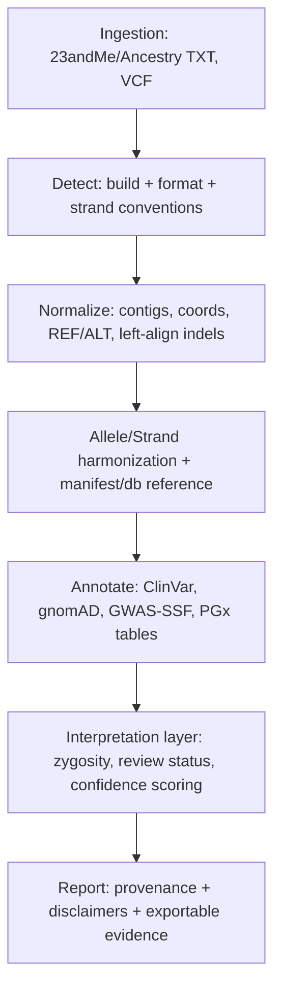

# Genomik-Praxisprimer für Software Engineers

## Executive Summary

Eine konsistente, sichere Consumer-Genomics-Annotation scheitert in der Praxis selten an “fehlenden Daten”, sondern fast immer an falsch ausgerichteten Repräsentationen: falscher Build, falsche Strandkonvention, fehlende Normalisierung, falsches Allel gezählt, falsche Annahmen bei fehlenden Markern. Das ist kein “Bio-Problem”, sondern ein Datenmodell- und Normalisierungsproblem. citeturn26view1turn26view0turn9view2turn9view3turn12search7turn27search1

Für eine GeneSight-ähnliche Pipeline ist sicherheitskritisch:

- **Build/Koordinaten/Ref-Allele erzwingen:** Jede Eingabe muss eindeutig an eine Referenz (GRCh37/GRCh38 + Contig-Naming) gebunden werden; “chr”-Präfixe und MT/chrM sind keine Kosmetik, sondern Teil des Identitätsschemas. citeturn39view1turn39view3turn12search2turn26view1  
- **Strand- und Allel-Normalisierung vor jeder Interpretation:** Consumer-Rohdaten sind oft plus/forward bezogen auf GRCh37, aber interop mit Illumina-Manifesten (TOP/BOT, A/B) und externen Ressourcen erfordert explizite Übersetzung. citeturn26view1turn26view0turn9view2turn9view3turn25search0  
- **Allele zählen statt rsID “matchen”:** Die Annotation ist immer an ein **konkretes Allel** gekoppelt (Pathogen/Risk/Effect allele). Ohne “allele-aware” Matching sind Ergebnisse strukturell falsch. citeturn9view3turn16view1turn33view1  
- **Klinische Aussagen strikt an Evidenzstufen binden:** ClinVar liefert aggregierte Klassifikationen und Review-Status; beides muss in UI/Score einfließen. citeturn28search0turn28search19turn19search4turn19search2  
- **Pharmakogenetik nicht als einzelne SNPs behandeln:** Star-Allele/Diplotyp/Phänotyp-Tabellen (CPIC/PharmVar) sind das Modell; Consumer-Arrays sind zudem CNV-blind (v. a. CYP2D6). citeturn20search8turn20search1turn20search16turn20search5turn10search7  
- **Validierung wie Software-Engineering:** Gold-Standards (GIAB/NIST), Regressionstests für Normalisierung/Allelezählung, Provenance-Logging. citeturn5search19turn5search15  

## Biologische Grundlagen für Annotation

DNA ist eine **gerichtete Zeichenkette** über einem Alphabet {A,C,G,T}, physikalisch als Doppelhelix organisiert; die beiden Stränge sind komplementär (A↔T, C↔G). Das ist die Grundlage für alle “Strand”-Fehlerklassen: dieselbe Stelle lässt sich als Base oder als Komplementbase beschreiben. citeturn9view1turn7search11turn7search0turn26view1

**Gene, Transkripte, Proteine (mentales Modell):** Ein Gen ist eine vererbliche Informationseinheit; in Eukaryoten besteht ein Gen typischerweise aus **Exons** (bleiben im mRNA-Endprodukt) und **Introns** (werden beim Spleißen entfernt). Promotoren steuern den Start der Transkription. mRNA wird anschließend zu Protein translatiert; Codons sind 3er-Buchstabenwörter, Open Reading Frames definieren den lesbaren Rahmen. citeturn6search10turn6search0turn9view0turn6search11turn6search1turn7search1turn7search8turn6search3turn6search14

**UTRs (5′/3′) sind transkribiert, aber nicht Teil der kanonischen Proteinsequenz:** Sie flankieren die Coding Sequence und beeinflussen Regulation (Stabilität/Translation etc.). Für Annotation heißt das: viele krankheitsrelevante Varianten liegen außerhalb der CDS, aber sind trotzdem biologisch wirksam. citeturn7search6turn6search5

**Variantenklassen als Datentypen:**  
SNVs/SNPs (Single Base), kleine Indels, CNVs (Copy-Number), strukturelle Varianten (SVs: größere Rearrangements). Für eine Pipeline ist wichtig, dass **jede Klasse andere Normalisierung/Matching-Regeln** braucht; rsID-only ist primär ein SNP/kleine-Indel-Shortcut. citeturn5search17turn10search7turn27search2

**Zygosität und Genotypzählung:** In diploiden Abschnitten liegt ein Genotyp als 0/1/2 Kopien eines Allels vor; bei X/Y existiert Hemizygosität (eine Kopie). Compound-Heterozygotie bedeutet zwei unterschiedliche pathogene Allele im selben Genlocus. Diese Begriffe sind direkt UI-relevant (Carrier vs. betroffen, Dominant/Rezessiv-Logik). citeturn7search3turn7search7turn37search2turn37search3

**Haplotypen, Phasing, Linkage Disequilibrium:** Ein Haplotyp ist ein Block gemeinsam vererbter Varianten; Phasing ordnet Varianten den beiden elterlichen Chromosomenkopien zu. LD ist der statistische “Kopplungsgrad” zwischen Varianten und ermöglicht z. B. strand alignment bei palindromischen SNPs durch Referenzmuster. citeturn3search0turn24search0turn25search0

**Allelfrequenz, Penetranz, Expressivität:**  
Allelfrequenz ist die Populationshäufigkeit eines Allels und ist ein Kernsignal für “zu häufig für hochpenetrante Mendel-Erkrankung”. Penetranz ist die Wahrscheinlichkeit, dass ein Genotyp überhaupt phänotypisch sichtbar wird; Expressivität beschreibt die Ausprägungsvariation. citeturn4search1turn4search3turn7search6turn19search2turn17search5

**Erbgänge:** autosomal-dominant/-rezessiv, X-chromosomal, mitochondrial (maternal). Für mtDNA kommen zusätzlich Heteroplasmie und Gewebeabhängigkeit dazu; Consumer-Arrays sind hierfür oft ungeeignet oder nur eingeschränkt interpretierbar. citeturn37search21turn37search0turn37search3turn37search1

```mermaid
flowchart LR
  DNA["DNA (Genom)"] -->|Transkription| pre_mRNA["prä-mRNA"]
  pre_mRNA -->|Spleißen| mRNA["mRNA (Transkript)"]
  mRNA -->|Translation (Codons)| Protein["Protein"]
  DNA --> Promoter["Promoter/Regulatorik"]
  mRNA --> UTR["5'/3' UTR (Regulation)"]
  DNA --> ExonIntron["Exons + Introns"]
```

## Labor- und Messmethoden

### Genotyping-Arrays

Consumer-Dienste setzen überwiegend SNP-Arrays ein: Pro Marker gibt es Sonden/Probes, Intensitäten werden in Genotypklassen (AA/AB/BB) geclustert; das Ergebnis ist eine Liste getesteter Positionen, nicht “das Genom”. Illumina unterscheidet mehrere Ebenen der Allel-/Strandbezeichnung: **TOP/BOT-Strand** und **A/B-Allele** sind interne, kontextbasierte Illumina-Konventionen, die nicht automatisch der dbSNP-FWD/REV-Orientierung entsprechen. citeturn9view2turn9view3turn25search13turn26view2

**Illumina-Manifest-Dateien sind der Schlüssel zur korrekten Übersetzung:** Für GSA stellt Illumina Manifest-Dateien (CSV/BPM) getrennt für GRCh37 und GRCh38 bereit sowie Cluster-Files (EGT), die das Clustering repräsentieren. Das Manifest enthält u. a. IlmnStrand/RefStrand und die SNP-Notation in Illumina-Syntax. citeturn26view2turn9view3

### Strand/Build in Consumer-Rohdaten

Für die zwei relevanten Consumer-Exports ist dokumentiert:

- 23andMe: Genotypen werden auf dem **Plus-Strang** der jeweiligen Referenz (standardmäßig GRCh37, optional GRCh38) berichtet; Mismatches zu Drittquellen entstehen u. a. durch andere Strang-/Build-Referenzen. citeturn26view1turn22search6  
- AncestryDNA: Genotypen werden auf dem **Forward-Strang relativ zu GRCh37** berichtet. citeturn26view0  

Das löst nicht automatisch das Interop-Problem, weil Datenbanken/Tools zusätzliche Konventionen nutzen (Illumina-Manifest, dbSNP/PTLP, GWAS-Summary-Harmonisierung). citeturn9view3turn14search5turn33view1

### Sequenzierung und Variant Calling

Sequenzierung bestimmt Basenfolgen direkt (WGS/WES/Targeted). WGS deckt das ganze Genom ab; WES fokussiert Exons und ist typischerweise günstiger als WGS, aber nicht proportional zur Exomgröße. citeturn6search6turn19search7turn10search4

**Kurzreads: typische Pipeline**: Reads werden gegen eine Referenz gemappt (z. B. BWA), als SAM/BAM gespeichert (SAM-Spezifikation), dann werden Varianten caller-seitig in VCF/BCF konsolidiert (z. B. GATK Best Practices für SNPs/Indels). citeturn23search0turn23search2turn23search1turn23search6  

**VCF-Qualitätsfelder (engineering-relevant):** DP (Depth), GQ (Genotype Quality), PL (Phred-scaled Genotype Likelihoods) sind standardisiert im VCF-Ökosystem und eignen sich als maschinenlesbare Confidence-Signale. citeturn26view3turn24search21turn23search1

### CNVs/SVs und Long Reads

CNVs können aus SNP-Arrays über Intensitätsmaße (BAF/LRR) modellbasiert geschätzt werden (z. B. PennCNV), sind aber methodisch schwieriger und tool-abhängig. citeturn10search7turn10search3  
Long-Read-Sequenzierung liest deutlich längere DNA-Fragmente und verbessert insbesondere SV- und Haplotyp-Auflösung. citeturn19search14turn19search19

### Targeted Assays

Sanger-Sequenzierung ist ein klassisches, hochgenaues Targeted-Verfahren (Chain-Termination), geeignet zur Bestätigung einzelner Varianten; PCR ist häufig die Vorstufe zur gezielten Amplifikation. citeturn23search3turn23search7turn23search11

## Datenformate und Standards

### Referenzgenome und Koordinaten

GRCh38 ist die aktuelle offizielle Bezeichnung der humanen Referenz; UCSC nennt GRCh38 “hg38”, aber das ist nicht der offizielle Name. Patch-Releases (z. B. GRCh38.pX) verändern Import/Alt-Loci ohne Koordinatenbruch; in Toolchains werden Patches oft aus Betriebsgründen nicht unterstützt. citeturn39view1turn39view3turn13search3  

GRCh38 ist zudem die erste große **koordinatenändernde** Assembly seit 2009 (vs. GRCh37) und enthält viele Fixes von Single-Base bis Mb-Skala. citeturn39view2

### rsID, VCF, HGVS, SPDI, VRS

- **rsID** ist ein Datenbank-Identifier (dbSNP/ClinVar/…); er ist praktisch, aber nicht vollständig stabil (Merges/Updates) und ersetzt nie die konkrete Allel- und Positionsrepräsentation. dbSNP berichtet Allele in der neuen RefSNP-Report-Logik konsistent “forward” relativ zur berichteten Sequenz (typisch: GRCh38/PTLP). citeturn14search5turn11search1turn27search3  
- **VCF** ist die dominante Austauschrepräsentation für Varianten; Indel-Normalisierung (Left-Alignment/Trimming) ist für Vergleichbarkeit entscheidend. citeturn24search21turn12search7  
- **HGVS** ist die humanlesbare klinische Nomenklatur (DNA/RNA/Protein). citeturn11search3turn11search11turn11search23  
- **SPDI** ist ein NCBI-Datenmodell (Sequence, Position, Deletion, Insertion) und wird u. a. zur Normalisierung/Interkonversion genutzt; SPDI-Position ist 0-basiert (praktisch relevant bei Off-by-one). citeturn14search1turn16view1turn14search5  
- **GA4GH VRS** ist eine maschinenpräzise Spezifikation für Variationsrepräsentation inkl. Normalisierung (fully-justified). citeturn27search9turn27search1turn11search18turn27search0  

### Liftover und Normalisierung

Liftover zwischen Assemblies basiert auf Whole-Genome-Alignments/Chain-Files und ist nicht “nur Kontig umbenennen”. Für GRCh37↔GRCh38 sind **UCSC liftOver** und das **Ensembl-Assembly-Map REST API** robuste Optionen; der frühere NCBI Remap-Dienst ist eingestellt. citeturn13search0turn13search9turn12search6turn12search0turn39view3  

**VCF-Normalisierung:** `bcftools norm` kann Indels left-alignen, normalisieren, multiallelische Sites splitten und REF gegen die Referenz prüfen. Das ist Pflicht, bevor du “gleich” vergleichst. citeturn12search7turn12search3

## Populationsgenetik für Annotation und PRS

### Hardy–Weinberg und QC

Hardy–Weinberg Equilibrium (HWE) ist ein Modell, das erwartete Genotypfrequenzen aus Allelfrequenzen ableitet; Abweichungen werden in GWAS/QC häufig als Signal für Genotyping-Fehler genutzt. citeturn17search7turn17search11turn35view0turn25search9

### Populationsstruktur und Ancestry

Populationsstruktur erzeugt systematische Allelfrequenzunterschiede zwischen Gruppen; das ist eine Hauptquelle für Scheinkorrelationen. PCA-basierte Korrektur (EIGENSTRAT/Prinzipal Components) ist Standard in GWAS; ADMIXTURE liefert modellbasierte “Ancestry proportions”. citeturn18search1turn18search0  

Für Consumer-Annotation ist das praktisch relevant, weil:

- Allelfrequenzen (z. B. aus gnomAD) populationsspezifisch variieren. citeturn4search1turn17search5turn17search9  
- GWAS/PRS sind oft deutlich besser in europäischen Kohorten als in anderen Ancestries; derzeitige PRS können Ungleichheiten verstärken, wenn man sie unkritisch “portiert”. citeturn18search2  

### Referenzpanels

1000 Genomes Phase 3 umfasst 2.504 Individuen aus 26 Populationen (ursprünglich GRCh37, reanalysiert auf GRCh38) und dient u. a. als Referenzpanel für Imputation/Phasing. citeturn17search8turn17search0turn24search3  
gnomAD aggregiert große Exom/Genom-Kohorten und ist die zentrale Frequenzreferenz in Forschung und klinischer Interpretation. citeturn17search9turn17search5  

### GWAS-Effektgrößen, Risikoallele, PRS

GWAS-Effektgrößen sind typischerweise **pro Effektallelzählung** (per-allele) angegeben; für binäre Merkmale als “increased odds per risk allele count”. citeturn35view0turn34search5  

Für PRS ist die Standardidee: **Dosage des Effektallels (0/1/2) × Gewicht**, summiert über Varianten; das PGS Catalog Download-Schema beschreibt diese Semantik explizit. citeturn36search9turn36search0  

Für produktive Implementationen ist relevant, dass das GWAS Catalog inzwischen GWAS-SSF erzwingt und harmonisierte Files bereitstellt: obligatorische Felder umfassen u. a. Chromosom, Position, Effektallel, anderes Allel, Beta/OR/HR, SE, Effektallelfrequenz und p-Wert; harmonisierte Versionen sind auf GRCh38, Allele “forward strand” orientiert, nicht harmonisierbare Varianten werden entfernt. citeturn33view1

## Klinische Interpretation und Pharmakogenetik

### ClinVar und ACMG-Grundlogik

ClinVar ist ein öffentliches Archiv von Varianten-Interpretationen (Krankheit und Drug Response) und berechnet aggregierte Klassifikationen getrennt nach **germline**, **somatic clinical impact** und **oncogenicity**. citeturn28search17turn28search0turn28search9turn28search1  

Die klinische Terminologie “pathogenic/likely pathogenic/VUS/likely benign/benign” ist durch ACMG/AMP standardisiert. citeturn19search4turn19search1  

**Review-Status** (Sterne) ist ein eigenständiges Evidenzsignal; ClinVar berechnet Review-Status pro Klassifikationstyp auf VCV/RCV. Ohne dieses Signal ist “Pathogenic”-UI gefährlich überkonfident. citeturn28search19turn28search3  

**Populationsfrequenz als Benign-Signal:** BA1 nutzt eine hohe Allelfrequenz (klassisch 5%) als Standalone-Benign-Evidenz; ClinGen SVI hat die BA1-Definition präzisiert (u. a. Populationsdatensatzgröße). citeturn19search2turn19search9

### Pharmakogenetik: Named Alleles, Diplotypen, Phänotypen

Pharmakogenetikmodell: Definiere **Named Alleles (Star-Allele)** als Variantensets, rufe daraus **Diplotyp** (zwei Haplotypen) ab, übersetze über Funktions-/Phänotyptabellen (z. B. Activity Score für CYP2D6) in klinische Kategorien. CPIC/ClinPGx stellen Diplotype-to-Phenotype Tabellen bereit. citeturn20search1turn20search5turn20search13  

PharmCAT implementiert diese Logik als Pipeline; der Named Allele Matcher ruft Diplotypen aus Variant-Calls ab und kann auch unabhängig laufen. CPIC stellt zudem Architekturbeispiele/Module für PharmCAT bereit. citeturn20search8turn20search0turn20search16turn20search4  

**Array-Limitierungen:** Komplexe Pharmakogene (v. a. CYP2D6) sind stark von SV/CNV geprägt; viele Star-Allele-Caller sind für NGS entworfen (Stargazer/Aldy) und modellieren Copy Number explizit. Das ist ein struktureller Hinweis: Consumer-Arrays liefern bei solchen Genen oft nur unvollständige Evidenz. citeturn20search2turn20search19turn20search11turn10search7  

## Engineering-Blueprint für GeneSight

### Datenfluss und Safety-Gates



Die Pipeline braucht harte Invarianten:

- **Jede Variante als (assembly, contig, pos, REF, ALT)** modellieren, rsID nur als sekundären Index. citeturn24search21turn14search5turn16view1  
- **REF-Allele-Verifikation gegen Referenzgenom** (oder gegen kuratierte Sequenzquelle) vor Interpretation. Tooling: `bcftools norm -f ref.fa` prüft REF-Matches. citeturn12search7turn12search3  
- **Allele- und Strandübersetzung explizit** (Illumina TOP/BOT/A/B ↔ plus/forward ↔ dbSNP/PTLP). citeturn9view2turn9view3turn14search5  

### Strand-/Allelnormalisierung: Kernalgorithmus

**Problemklasse:** Dieselbe biochemische Variante kann als C>T auf plus-Strang oder als G>A auf minus-Strang erscheinen. Consumer-Rohdaten sind zwar oft plus/forward bezogen auf GRCh37, aber externe Quellen können je nach Pipeline, Manifest, oder historischer Konvention abweichen. citeturn26view1turn26view0turn9view3turn14search5  

**Ambiguity:** Palindromische SNPs (A/T oder C/G) sehen nach Komplementierung identisch aus; reine Strand-Komplementierung reicht nicht, um Orientierung sicher aus Daten allein zu inferieren. Tools wie Genotype Harmonizer lösen das u. a. über LD-Muster; snpflip markiert reverse/ambiguous SNPs. citeturn25search0turn25search1  

Pseudocode (allele-aware, strand-aware, palindromic-aware):

```text
# Inputs:
# - user_genotype: two alleles as characters (e.g., ["C","T"] or ["A","A"])
# - record_ref, record_alt: alleles as stored in a reference-oriented database (VCF-style)
# - record_strand: "+" or "-" if known; else None
# - user_strand: "+" if export guarantees plus/forward (often true), else None
# - ref_genome_lookup(contig, pos): returns reference base at pos for chosen assembly

COMPLEMENT = {"A":"T","T":"A","C":"G","G":"C"}

function is_palindromic(a1, a2):
  pair = set([a1,a2])
  return pair == set(["A","T"]) or pair == set(["C","G"])

function normalize_alleles_to_plus(alleles, strand):
  if strand == "+":
    return alleles
  if strand == "-":
    return [COMPLEMENT[x] for x in alleles]
  raise error("unknown strand")

function count_alt_copies(genotype_alleles, alt_allele):
  # genotype_alleles already normalized to same strand as alt_allele
  return (genotype_alleles[0] == alt_allele) + (genotype_alleles[1] == alt_allele)

# Main:
assert ref_genome_lookup(contig,pos) == record_ref   # or fail-safe
db_ref_alt = [record_ref, record_alt]

# If both sides are guaranteed plus, skip strand flip.
if user_strand == "+" and record_strand == "+":
  gt = user_genotype
else:
  # If record strand known, normalize user genotype into record orientation
  gt = normalize_alleles_to_plus(user_genotype, user_strand)
  db_ref_alt = normalize_alleles_to_plus(db_ref_alt, record_strand)

# Palindromic guard:
if is_palindromic(record_ref, record_alt) and (user_strand is None or record_strand is None):
  return "AMBIGUOUS_STRAND"   # require external resolver (manifest/LD/frequency)

alt_count = count_alt_copies(gt, db_ref_alt[1])
return alt_count  # 0/1/2
```

Warum diese Checks zwingend sind:

- VCF/ClinVar/dbSNP orientieren sich an Referenzsequenzen und erwarten konsistente REF/ALT; dbSNP betont “alleles forward to the reported sequence” und Angleichung an VCF/HGVS/SPDI. citeturn14search5turn11search1turn16view1turn24search21  
- Illumina-Manifeste listen SNPs in A/B-Reihenfolge nach TOP/BOT, nicht in REF/ALT-Reihenfolge; ohne Manifestübersetzung ist REF/ALT-Matching falsch. citeturn9view3turn9view2  
- GWAS-SSF harmonisiert Position/Allele; die harmonisierte GWAS-Catalog-Version orientiert Allele auf forward strand und GRCh38, aber legacy Inputs sind heterogen. citeturn33view1  

### Konkretes Beispiel: Allelezählung an einer realen Variante

Variante rs12248560 (CYP2C19*17) ist in ClinVar mit GRCh38-Location **10:94761900 C>T** (HGVS: NC_000010.11:g.94761900C>T) und SPDI **NC_000010.11:94761899:C:T** dokumentiert. citeturn16view1turn16view3  

Wenn (nach Build/Strand-Normalisierung) gilt:

- REF = C  
- ALT = T  
- User-Genotyp = C/T  

Dann ist ALT-Kopiezahl = 1. Für GWAS/PRS/“risk allele = T” wäre das “heterozygous risk (1 copy)”; für pharmakogenetische Sternallel-Definitionen wäre es nur ein Marker innerhalb eines Diplotyp-Modells, nicht der Phänotyp selbst. citeturn16view1turn20search1turn20search0turn35view0  

### Missing Data Policies und Confidence Scoring

**Missingness darf nicht in “Reference” umgedeutet werden.** Consumer-Dateien enthalten “Not determined”/missing; bei 23andMe wird explizit darauf hingewiesen, dass Rohdaten nur informational sind und nicht für Diagnostik. citeturn40view0turn26view1  

Für Confidence:

- Sequenz-Vars: verwende DP/GQ/PL und FILTER, wie im VCF-Ökosystem vorgesehen. citeturn26view3turn24search21turn23search1  
- Array-Vars: verwende, wenn vorhanden, GenTrain/Cluster-Metriken aus GenomeStudio Reports; Illumina beschreibt Report-Typen und Output-Formate. citeturn25search10turn25search13turn25search3  

**CNV/SV-Flags:** Bei pharmakogenetisch relevanten Genen mit CNV (CYP2D6) und generell bei SVs muss UI/Interpretation “nicht bestimmbar mit Array/WGS-short-only” kennen; PennCNV zeigt, dass SNP-Arrays CNVs modellieren können, aber Tool-Performance variiert stark. citeturn10search7turn10search3turn20search5  

### Validierung: Testdaten und Regressionstests

- Mindeststandard: NIST/Genome-in-a-Bottle Referenzmaterialien zur Bewertung von Variant-Calling-Performance und Fehlerprofilen. citeturn5search19turn5search15  
- Zusätzlich: gezielte “golden cases” für Strand/Build/Palindromic/Indel-Normalisierung (z. B. künstliche VCFs, die bei `bcftools norm` deterministisch werden). citeturn12search7turn27search1  

### Priorisierte Safety-Checklist für Implementierung

**Phase 0: Datenmodell- und Normalisierungsfundament (höchste Priorität)**  
- Assembly/Contig-Naming strikt (GRCh37/38, chr vs. numeric, MT/chrM) inkl. Metadaten erzwingen. citeturn39view3turn26view1turn39view1  
- REF-Allele verifizieren; Indels left-align/trim; multiallelic split. citeturn12search7turn12search3turn24search21  
- Strand/Allel-Harmonisierung über Manifest/db; palindromic SNPs nur mit Resolver (Manifest/LD/Frequenz) oder als “ambiguous” blockieren. citeturn9view3turn25search0turn25search1turn33view1  

**Phase 1: Klinische Evidenz korrekt abbilden**  
- ClinVar: clinsig + review status + Klassifikationstyp (germline vs somatic) getrennt führen; UI/Score daran koppeln. citeturn28search0turn28search19turn28search1  
- Frequenzfilter-Regeln (BA1/BS1/PM2) implementieren; Popmax/Ancestry-spezifische Frequenzen bevorzugen. citeturn19search2turn17search5turn17search9  

**Phase 2: Pharmakogenetik als Named-Allele-System**  
- Star-Allele-Definitionen aus PharmVar/CPIC, Diplotype→Phenotype Tabellen aus CPIC/ClinPGx, Pipeline analog PharmCAT. citeturn11search12turn20search1turn20search8turn20search16  
- Missing SNPs in Diplotypen: “no call / partial match” statt Default-*1. citeturn20search0turn20search4  
- CYP2D6/CNV: explizit “nicht zuverlässig aus Arrays” (oder: nur eingeschränkte Heuristiken mit klarer Unsicherheitskennzeichnung). citeturn20search5turn10search7turn20search19  

**Phase 3: GWAS/PRS robust und fair**  
- Effektallelzählung (0/1/2) auf harmonisierte Allele; nur GWAS-SSF/harmonisierte Quellen oder eigener Harmonizer. citeturn33view1turn35view0turn36search9  
- Ancestry-Limitierungen und Portabilität als zentraler Disclaimer/Score-Modifier. citeturn18search2turn18search7  

## Lernpfad für Informatiker

| Thema | Zielniveau | Kernübung (Engineering-nah) | Warum das wichtig ist |
|---|---:|---|---|
| Referenzgenome, Builds, Koordinaten | solide | Parser, der GRCh37/38 + chr-Namen normalisiert, und bei Mismatch hart bricht | verhindert “stille” Off-by-build Fehler citeturn39view3turn12search6turn39view1 |
| VCF/BCF + Normalisierung | solide | `bcftools norm`-Äquivalenztests: gleiche Indel in 3 Repräsentationen → identische kanonische Form | Variant-Vergleichbarkeit citeturn12search7turn24search21 |
| Strand/Allel-Harmonisierung | sehr solide | Unit-Tests für Komplementierung + palindromic Guards; Integration von Manifest-Resolver | häufigster Consumer-Fehler citeturn9view2turn9view3turn25search0 |
| Genotyp/Phasing/Haplotyp | Grundlagen | VCF-Reader: GT mit “/” vs “|”, Phase sets (PS) erkennen | Diplotyp/PRS-Korrektheit citeturn24search21turn24search13turn24search0 |
| gnomAD/Allelfrequenzen | solide | “BA1-Flagger”: Variant + Popfreq → benign evidence label | klinische Plausibilität citeturn17search9turn19search2turn17search5 |
| ClinVar/ACMG | solide | Renderer: ClinVar clinsig + review status → UI-tiering | Patientensicherheit citeturn28search0turn28search19turn19search4 |
| PGx (Star-Allele) | solide | Minimaler Named-Allele-Matcher (2–3 Gene) mit “partial match” Rückgabemodell | verhindert “SNP→Phänotyp”-Fehlschlüsse citeturn20search0turn20search1turn11search12 |
| GWAS/PRS | Grundlagen→solide | Loader für GWAS-SSF/PGS scoring files, Effektallelzählung, Scoreberechnung | kontrollierte Risiko-Kommunikation citeturn33view1turn36search9turn36search0 |
| Validierung/Truth Sets | solide | Regression suite gegen GIAB; “golden” palindromic cases | stabile Releases citeturn5search19turn5search15 |

## Autoritative Ressourcen und Tooling

**Primäre Datenquellen (offline-bundle-fähig, aber teils groß):**

- ClinVar FTP/VCF und Dokumentation (Coverage/Limitierungen, Release-Zyklus). citeturn21search3turn27search2turn27search6turn21search19  
- dbSNP Release Notes/FTP und Orientierung (RefSNP “forward orientation”, VCF/JSON). citeturn27search3turn14search5turn11search1  
- gnomAD (Frequenzen, Nutzung in Interpretation). citeturn17search9turn17search5turn4search1  
- GWAS Catalog GWAS-SSF (Pflichtfelder, harmonisierte forward-strand, GRCh38). citeturn33view1turn17search22  
- PharmVar/CPIC/ClinPGx (Alleldefinitionen, Diplotype→Phenotype). citeturn11search12turn20search1turn20search17  

**Referenz-Implementationen/Tools (für Architektur-Studium):**

- PharmCAT (Named Allele Matcher, Pipeline-Architektur). citeturn20search8turn20search0turn20search16  
- Ensembl VEP (allele-aware Annotation; Option, allele matching einzuschalten/abzuschalten). citeturn21search20turn21search4turn21search16  
- HTSlib/bcftools (VCF/BCF I/O, Normalisierung, Tabix). citeturn21search9turn12search7turn23search2  
- GA4GH VRS + vrs-python (Normalisierung, Identifier, Interkonversion). citeturn27search9turn27search0turn27search21  
- Strand-Resolver: Genotype Harmonizer, snpflip. citeturn25search0turn25search1  

```text
# URL-Paket (kuratierte Einstiegspunkte)
# Referenzgenome / Assemblies
https://www.ncbi.nlm.nih.gov/grc/help/faq/
https://rest.ensembl.org/documentation/info/assembly_map
https://genome.ucsc.edu/cgi-bin/hgLiftOver

# Consumer-Strand/Build
https://eu.customercare.23andme.com/hc/en-us/articles/115002090907-Raw-Genotype-Data-Technical-Details
https://support.ancestry.com/articles/en_US/Support_Site/Downloading-DNA-Data

# ClinVar
https://www.ncbi.nlm.nih.gov/clinvar/intro/
https://www.ncbi.nlm.nih.gov/clinvar/docs/ftp_primer/
https://www.ncbi.nlm.nih.gov/clinvar/docs/clinsig/
https://www.ncbi.nlm.nih.gov/clinvar/docs/review_status/

# dbSNP / SPDI
https://ncbiinsights.ncbi.nlm.nih.gov/2025/03/18/dbsnp-release-157/
https://www.ncbi.nlm.nih.gov/core/assets/snp/docs/RefSNP_orientation_updates.pdf
https://pmc.ncbi.nlm.nih.gov/articles/PMC7523648/

# VCF / Normalisierung
https://samtools.github.io/hts-specs/VCFv4.4.pdf
https://www.htslib.org/doc/bcftools.html

# Illumina TOP/BOT, Manifeste
https://www.illumina.com/documents/products/technotes/technote_topbot.pdf
https://knowledge.illumina.com/microarray/general/microarray-general-reference_material-list/000001489

# GWAS-SSF
https://oup.silverchair-cdn.com/article-minimal/7893318  # GWAS Catalog NAR update (GWAS-SSF Pflichtfelder/Harmonisierung)

# CPIC/PharmCAT/PharmVar
https://www.pharmvar.org/gene/cyp2c19
https://www.clinpgx.org/page/cpicFuncPhen
https://pharmcat.clinpgx.org/methods/NamedAlleleMatcher-101/

# GA4GH VRS
https://vrs.ga4gh.org/en/stable/conventions/normalization.html
https://github.com/ga4gh/vrs-python
```